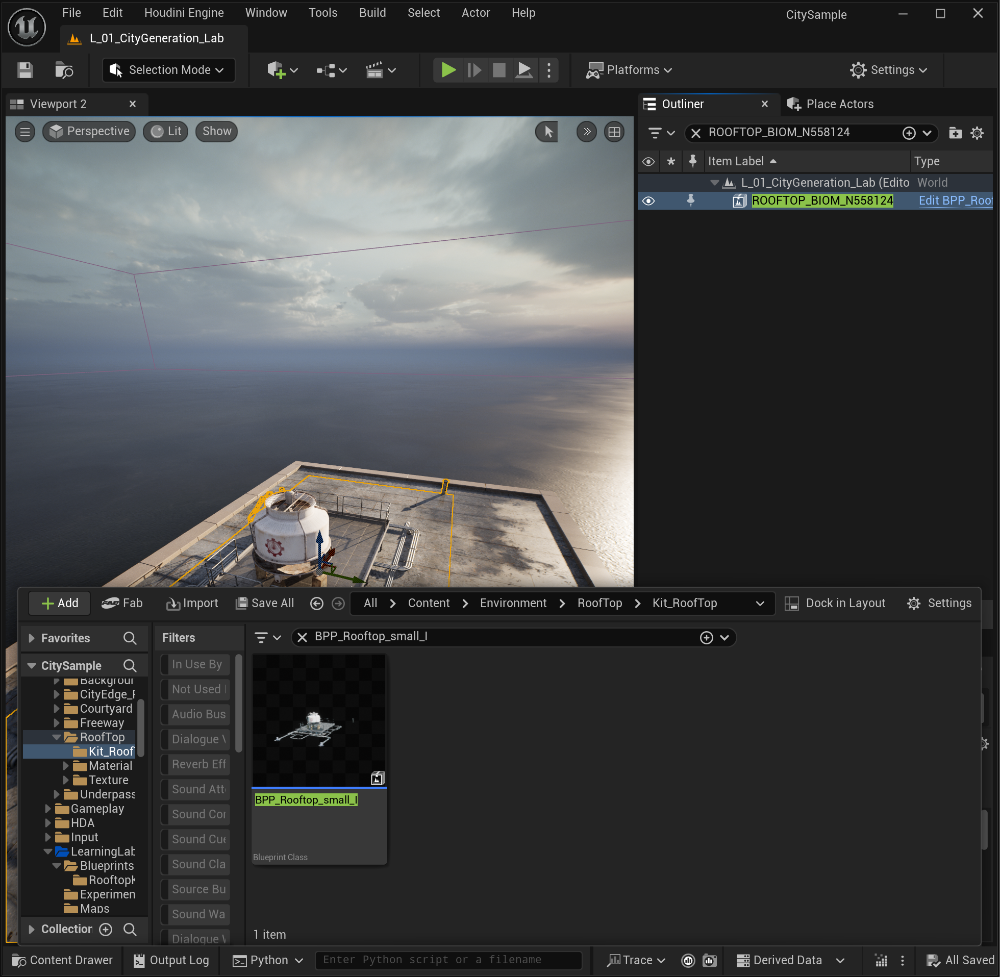
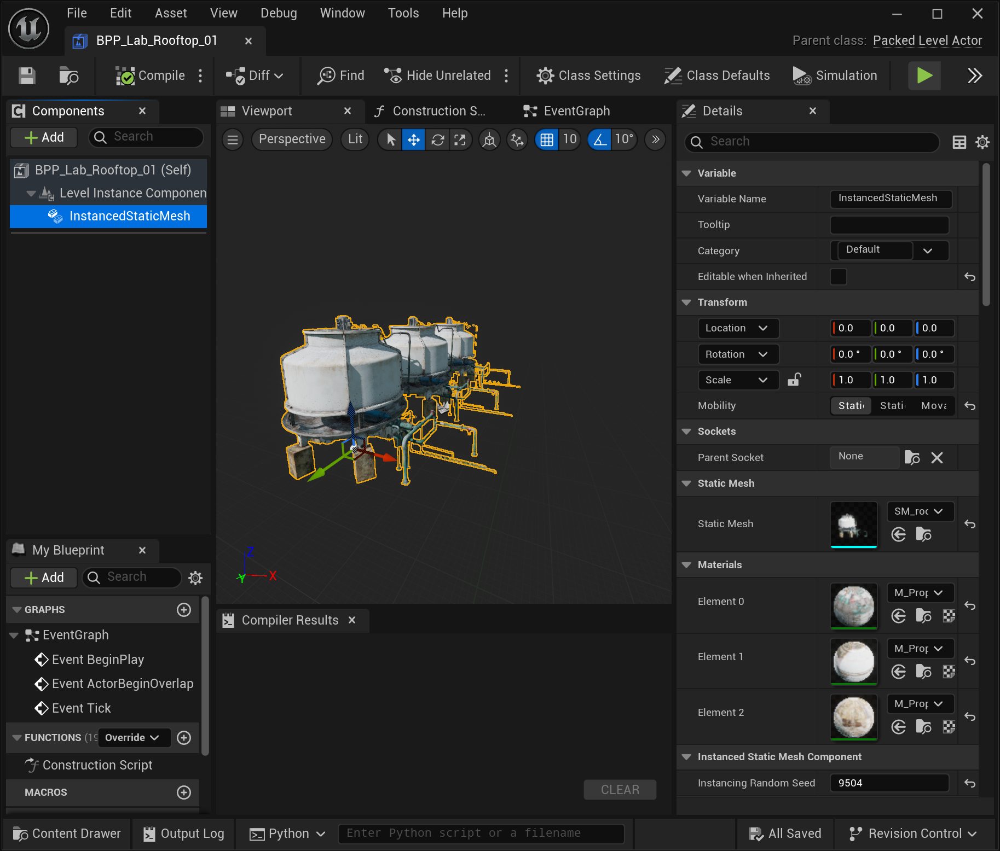
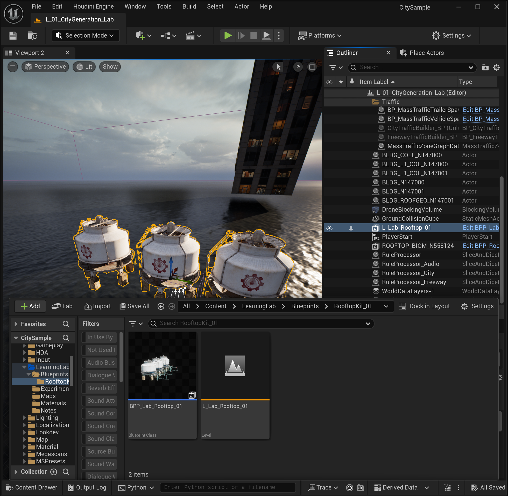
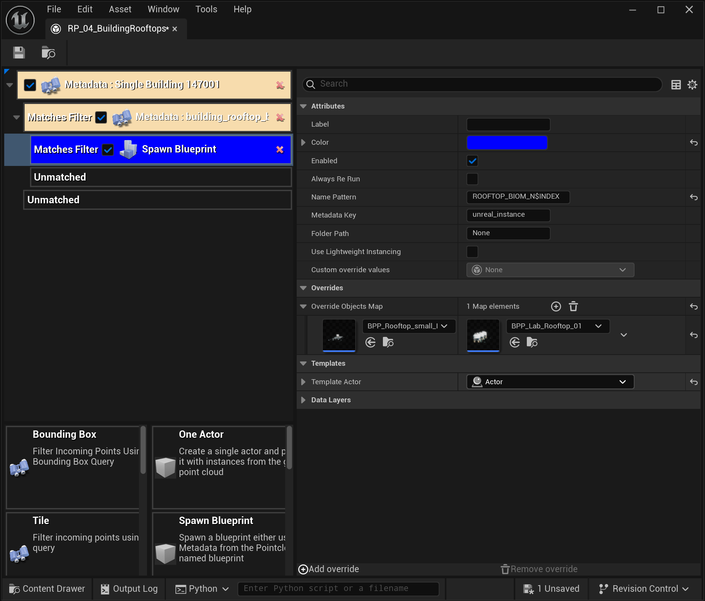
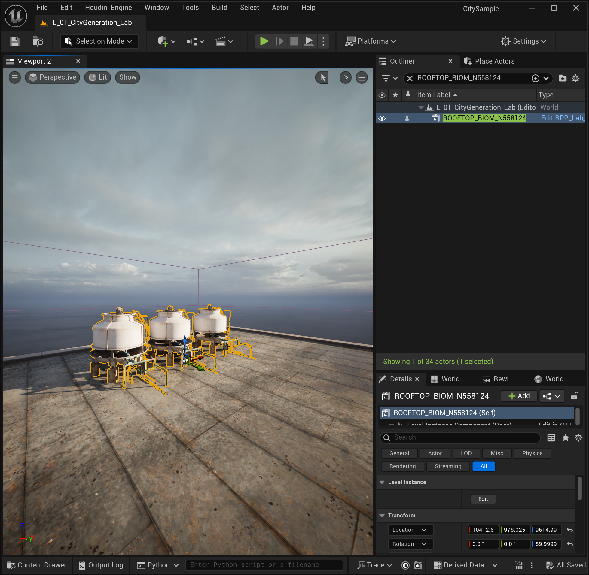
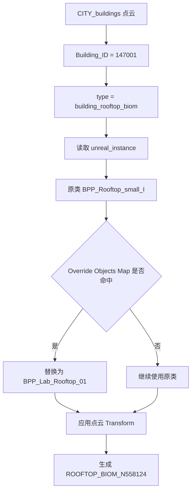

---
tags:
  - UE5
  - CitySample
  - RuleProcessor
  - PackedLevelActor
  - Obsidian
status: 已完成
project: F:\CitySample
map: /Game/LearningLab/Maps/L_01_CityGeneration_Lab
rule: /Game/LearningLab/Experiments/RP_04_BuildingRooftops
---

# 04｜用自定义 Packed Level Actor 替换屋顶蓝图

> 本章成果：保留 City Sample 点云中的位置、旋转和筛选逻辑，只把 `building_rooftop_biom` 原本引用的屋顶蓝图替换为自己制作的三水箱套件。


## 一、是什么（What）

这一步不是手工把三个水箱摆到建筑上，也不是修改 City Sample 的原始 `BPP_Rooftop_small_I`。实际做法是：

1. 用三个 `SM_roof_Compressor_A_N1` 制作一个自己的屋顶套件；
2. 将它打包成一个新的 Packed Level Actor；
3. 在 `Spawn Blueprint` 的 `Override Objects Map` 中建立“原蓝图 → 自定义蓝图”的映射；
4. 重新运行 Rule Processor，让点云仍按原坐标生成，但实例化我们的蓝图。

本次涉及的主要资产：

| 类型 | 资产路径 |
|---|---|
| 点云 | `/Game/City/Small_City/PBC/CITY_buildings` |
| 实验地图 | `/Game/LearningLab/Maps/L_01_CityGeneration_Lab` |
| 屋顶规则 | `/Game/LearningLab/Experiments/RP_04_BuildingRooftops` |
| 原屋顶蓝图 | `/Game/Environment/Rooftop/Kit_RoofTop/BPP_Rooftop_small_I` |
| 水箱静态网格 | `/Game/Prop/Kit_roof_Compressor/Mesh/SM_roof_Compressor_A_N1` |
| 自定义套件关卡 | `/Game/LearningLab/Blueprints/RooftopKit_01/L_Lab_Rooftop_01` |
| 自定义 Packed Level Actor | `/Game/LearningLab/Blueprints/RooftopKit_01/BPP_Lab_Rooftop_01` |

原始屋顶蓝图由多个 Instanced Static Mesh 组件构成，包括屋面、管线、平台和设备：



我们制作的新资产则由三个水箱模块组成：



## 二、为什么这样做（Why）

### 1. 为什么用 Override，而不是修改 `unreal_instance`

点云中的 `unreal_instance` 已经保存了原始蓝图类，它同时承担“要生成什么”的数据入口。直接改点云或原始 City Sample 资产，会影响其他地图和规则，维护成本也更高。

`Override Objects Map` 提供了一层非破坏式重定向：

```text
点云要求生成 BPP_Rooftop_small_I
                ↓
Spawn Blueprint 查找 Override Objects Map
                ↓
命中映射后改为生成 BPP_Lab_Rooftop_01
```

点云数据保持不变，实验也可以随时移除映射恢复原结果。

### 2. 为什么要先制作 Packed Level Actor

一个屋顶套件通常不是单个模型，而是一组有固定相对位置的网格。Packed Level Actor 可以把这组布置封装成一个可被 `Spawn Blueprint` 实例化的蓝图类。

它带来的好处：

- 三个水箱的相对位置只需编辑一次；
- Rule Processor 只需要替换一个类；
- 套件仍然可以作为一个整体生成、移动和复用；
- 不需要为每个水箱单独增加一条点云记录。

### 3. 为什么替换后位置仍然正确

Rule Processor 并不是从自定义蓝图里猜测建筑位置。位置、旋转和缩放来自点云中那条 `building_rooftop_biom` 记录；Override 只改变被实例化的类。

因此数据职责被分成两部分：

- 点云点：决定“在哪里、朝向哪里、属于哪栋建筑”；
- 蓝图类：决定“这个位置上出现什么内容”。

只要自定义 Packed Level Actor 的 Pivot 合理，它就会沿用原点云记录的变换并落到屋顶上。

## 三、怎么做（How）

### 步骤 1：确认目标点和原始蓝图

`RP_04_BuildingRooftops` 的过滤链保持为：

```text
Metadata：Single Building 147001
└─ Building_ID = 147001
   └─ Matches Filter
      └─ Metadata：building_rooftop_biom
         └─ type = building_rooftop_biom
            └─ Matches Filter
               └─ Spawn Blueprint
```

Report 结果应为：

```text
Building_ID = 147001          → 1896 points
type = building_rooftop_biom  → 1 point
Spawn Blueprint               → Instance count = 1
```

选中生成的 `ROOFTOP_BIOM_N558124` 后，通过下面命令确认其实际类：

```python
import unreal
actors = unreal.get_editor_subsystem(
    unreal.EditorActorSubsystem
).get_selected_level_actors()
unreal.log("Selected Actor Class: " + str(actors[0].get_class().get_path_name()))
```

原始结果：

```text
/Game/Environment/Rooftop/Kit_RoofTop/BPP_Rooftop_small_I.BPP_Rooftop_small_I_C
```

### 步骤 2：制作自定义屋顶组合

将 `SM_roof_Compressor_A_N1` 拖入实验地图三次，调整为需要的相对排布。这里的重点是套件内部的相对位置，而不是它暂时位于实验地图的哪个世界坐标。

### 步骤 3：创建 Packed Level Actor

同时选中三个水箱，在右键菜单中选择：

```text
Level → Create Packed Level Actor...
```

Pivot Type 使用 `Center Min Z`，然后保存为：

```text
/Game/LearningLab/Blueprints/RooftopKit_01/L_Lab_Rooftop_01
/Game/LearningLab/Blueprints/RooftopKit_01/BPP_Lab_Rooftop_01
```

`Center Min Z` 把 Pivot 放在组合包围盒底部中央，更适合将屋顶设施贴到点云给出的屋面锚点上。



### 步骤 4：配置 Override Objects Map

打开 `RP_04_BuildingRooftops`，选中蓝色的 `Spawn Blueprint`，在右侧展开 `Overrides → Override Objects Map`，新增一个 Map 元素：

| 位置 | 值 |
|---|---|
| Key（左侧） | `BPP_Rooftop_small_I` |
| Value（右侧） | `BPP_Lab_Rooftop_01` |

最终配置如下：



这里 Key 必须是点云 `unreal_instance` 当前指向的原始类，Value 才是替代它的新类。填反后不会得到想要的替换结果。

`Spawn Blueprint` 其他关键参数保持：

| 参数 | 值 | 含义 |
|---|---|---|
| Name Pattern | `ROOFTOP_BIOM_N$INDEX` | 使用点云记录索引命名 Actor。 |
| Metadata Key | `unreal_instance` | 从点云读取原始蓝图类。 |
| Use Lightweight Instancing | 关闭 | 本实验生成普通 Actor，便于观察与调试。 |

### 步骤 5：重新运行屋顶规则

保存规则后，在关卡 Python 输入框执行：

```python
import unreal
world = unreal.get_editor_subsystem(
    unreal.UnrealEditorSubsystem
).get_editor_world()
manager = [
    m for m in unreal.SliceAndDiceManager.get_slice_and_dice_managers(world)
    if m.get_actor_label() == "RuleProcessor"
][0]
pc = unreal.load_asset("/Game/City/Small_City/PBC/CITY_buildings")
rules = unreal.load_asset("/Game/LearningLab/Experiments/RP_04_BuildingRooftops")
mapping = manager.find_or_add_mapping(pc, rules)
unreal.log("Generation result: " + str(
    manager.run_rules_on_mappings([mapping])
))
```

成功输出：

```text
Generation result: True
```

生成 Actor 仍名为：

```text
ROOFTOP_BIOM_N558124
```

但其类已经被 Override 为 `BPP_Lab_Rooftop_01`，画面中出现三个自定义水箱：




## 四、工作原理（Principle）



可以把它理解成一次“查表替换”：

```text
SpawnClass = point[unreal_instance]
if SpawnClass in OverrideObjectsMap:
    SpawnClass = OverrideObjectsMap[SpawnClass]
spawn(SpawnClass, point.transform)
```

### 为什么 Actor 名称没有变

`ROOFTOP_BIOM_N558124` 来自 `Name Pattern = ROOFTOP_BIOM_N$INDEX`。`$INDEX` 是点云记录索引，不是蓝图名，也不是 `Building_ID`。

Override 改变的是实例化类，不会改变这条点云记录的索引，所以名称保持不变是正确结果。

## 五、验证清单

- [x] `RP_04_BuildingRooftops` Report 命中 1 个 Rooftop Biome 点；
- [x] `Override Objects Map` 左侧是原类，右侧是自定义类；
- [x] 执行结果为 `Generation result: True`；
- [x] Outliner 中仍生成 `ROOFTOP_BIOM_N558124`；
- [x] 该 Actor 的类链接显示为 `BPP_Lab_Rooftop_01`；
- [x] 三个水箱按套件内部布局出现，并落在 147001 的屋面上；
- [x] 主体、Roof Geo 和 Rooftop Biome 的位置关系保持一致。

## 六、容易出错的地方

### 1. 把三个水箱直接留在实验地图里

直接摆放的三个 Static Mesh Actor 只是制作素材。规则生成需要的是打包后的 `BPP_Lab_Rooftop_01`。验证完成后，手工摆放的素材应隐藏、删除或放进专用制作关卡，避免把它们误认为程序生成结果。

### 2. Override 的 Key/Value 填反

正确方向是：

```text
原始类 → 自定义类
```

它表达“遇到原始类时，替换成自定义类”。

### 3. 只改 Label，没有改数据字段

节点 Label 只是阅读名称。真正影响规则的是 `Building_ID`、`type`、`unreal_instance`、Map Key 和 Map Value。

### 4. 看到 `Revision control is not enabled` 以为生成失败

这是 UE 编辑器内置 Source Control 没有启用的提示，与 Rule Processor 是否成功无关。应以：

```text
Generation result: True
```

以及 Outliner/视口结果为准。Git/GitHub 版本控制在编辑器外独立进行。

### 5. Pivot 不合理导致套件悬空或穿入屋面

Override 会沿用点云 Transform，但不会自动修复自定义资产内部的 Pivot。若位置整体有固定偏差，应优先检查 Packed Level Actor 的 Pivot 和套件内部局部坐标，而不是改点云坐标。

## 七、本阶段结论

- 已读懂 `Spawn Blueprint` 如何通过 `unreal_instance` 决定生成类；
- 已创建独立的自定义 Packed Level Actor 屋顶套件；
- 已使用 `Override Objects Map` 非破坏式替换 City Sample 原屋顶蓝图；
- 已证明“点云负责放置，蓝图负责内容”的职责分离；
- 已完成从复制原规则到设计自定义生成内容的第一次闭环。

## 下一步

下一步可以把固定替换推进到“可变化的屋顶系统”：制作第二个自定义 Rooftop Kit，对比不同 `unreal_instance`、Building ID 或 Metadata 分支如何选择不同套件，并记录 Pivot、碰撞和性能差异。
