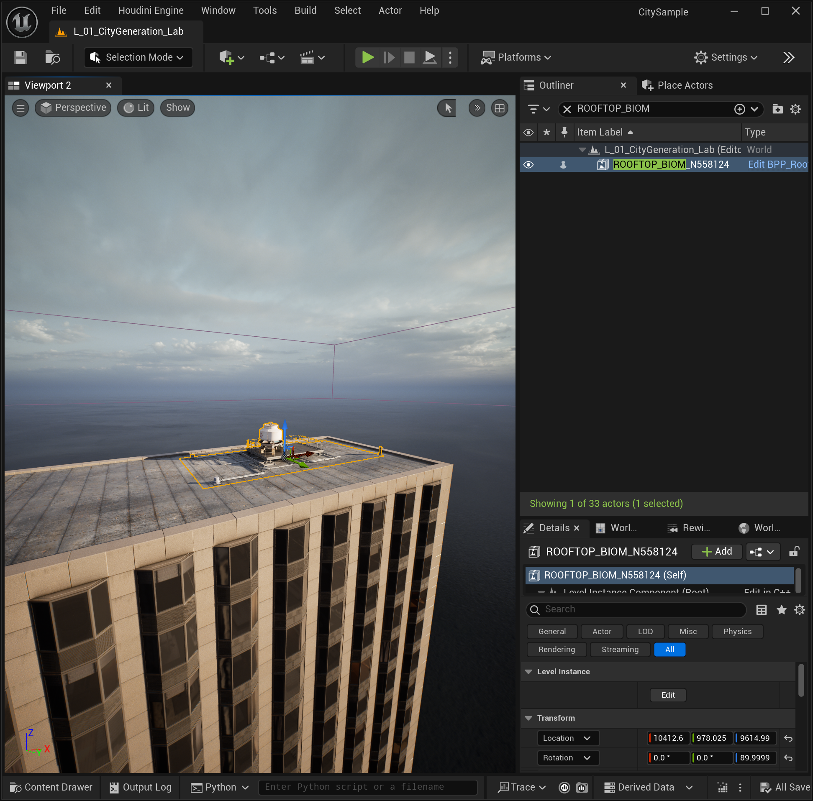

# UE5 City Sample Rule Processor 学习实验

这是一个面向学习的 Unreal Engine 5 City Sample Rule Processor 实验仓库，记录如何从 `CITY_buildings` 点云中逐步筛选并生成单栋建筑的主体、碰撞、独立屋顶几何和 Rooftop Biome。

当前版本：`v0.1.0`

## 已完成内容

- 创建独立的 `LearningLab` 实验地图；
- 使用 `Building_ID` 提取完整单栋建筑；
- 分离普通可见模块与带 `CollisionEnabled` 标记的模块；
- 生成独立的 `building_collision` 碰撞 Actor；
- 识别并生成 `SM_arbitrary_roof_*` Roof Geo；
- 使用 `building_rooftop_biom` 和 `unreal_instance` 生成屋顶蓝图实例；
- 记录 Bounding Box 在模块级过滤时切坏完整建筑的原因。



## 仓库结构

```text
Content/
├─ LearningLab/                         实验地图与 Rule Processor 规则资产
└─ __ExternalActors__/LearningLab/      World Partition 地图的配套 Actor 数据

Notes/
├─ CitySample学习笔记.md                Obsidian/Markdown 学习笔记
└─ assets/CitySample/                   操作过程与结果截图
```

## 环境与依赖

- Unreal Engine `5.5.4`；
- Epic Games City Sample；
- City Sample 自带的 Point Cloud / Rule Processor（Slice And Dice）相关插件和依赖；
- 本仓库不能脱离 City Sample 原工程独立运行。

## 使用方法

1. 通过 Epic Games Launcher 获取并创建 City Sample 工程；
2. 关闭 Unreal Editor；
3. 将本仓库的 `Content` 文件夹合并到 City Sample 工程的 `Content` 文件夹；
4. 保持 `Content/__ExternalActors__/LearningLab` 的相对路径不变；
5. 打开地图：

```text
/Game/LearningLab/Maps/L_01_CityGeneration_Lab
```

6. 在 `/Game/LearningLab/Experiments` 中查看各阶段 Rule Processor 规则。

建议先阅读 [CitySample 学习笔记](Notes/CitySample学习笔记.md)，其中按照“是什么、为什么、怎么做”记录了完整实验过程、Report 数据、Python 命令和排错结论。

## 当前实验资产

| 资产 | 用途 |
|---|---|
| `RP_01_Buildings` | `Building_ID=147000` 的建筑主体 |
| `RP_02_BuildingCollision` | `Building_ID=147000` 的独立碰撞 |
| `RP_03_BuildingRoofGeo` | `Building_ID=147001` 的独立 Roof Geo |
| `RP_04_BuildingRooftops` | `Building_ID=147001` 的 Rooftop Biome |
| `RP_05_Buildings_147001` | `Building_ID=147001` 的建筑主体 |

## 重要说明

本仓库用于技术研究和学习记录，不包含完整 City Sample 工程，也不包含运行所需的大规模原始模型、材质、点云和插件源码。使用者必须自行从 Epic Games 官方渠道取得 City Sample，并遵守 Epic Games/Unreal Engine 对相关内容的许可条款。

仓库中的 `.uasset`、`.umap` 依赖 City Sample 内容引用，不应被视为对 Epic Games 第三方内容授予任何额外许可。

